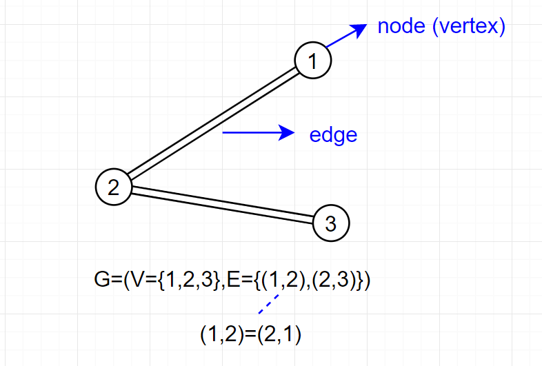
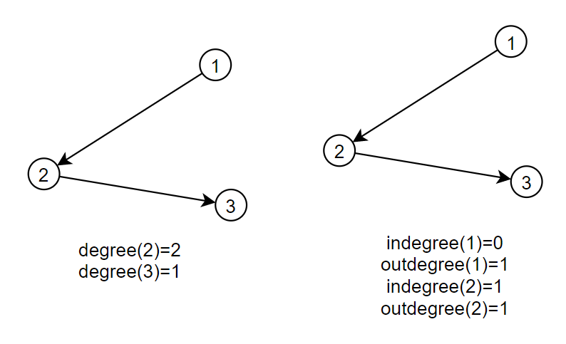

그래프
====
* 자료구조의 일종
* G = (V, E)로 나타내는데, V는 vertex(node라 하기도 한다)의 집합이고 E는 edge의 집합이다.
    * vertex는 그래프의 각 분기점, edge는 vertex를 잇는 줄로 생각하면 편하다.
    
* edge의 구분, 종류
    * directed vs undirected
        * directed는 (a, b) != (b, a)
        * undirected는 (a, b) == (b, a)
    * multi-edge/self-edge
        * 두 vertex 사이에 edge가 여러개인 경우를 multi-edge라 한다.
        * edge의 양 끝이 같은 경우 이를 self-edge라 한다.
* degree
    * 한 vertex에 연결되어 있는 edge의 수를 나타낸다.
    * 
* 경로/사이클
    * 그래프에서는 주로 경로, 사이클를 묻는 문제가 많이 출제된다.
    * 임의의 한 vertex에서 임의의 한 vertex으로 가는 경로 중,
    * 출발 vertex와 도착 vertex가 같은 경로를 사이클이라 한다.
* 단순 경로/사이클
    * 경로/사이클이 같은 vertex을 두번 이상 방문하지 않을때, 이를 단순 경로/사이클이라 한다.

그래프의 구현
====
1. 인접 행렬(Adjacency-matrix)를 사용하는 법.
    * vertex의 수를 n이라고 할때, n * n 크기의 이차원 배열을 선언하는데, A[i][j]의 가 1이면 edge가 있고, 0이면 edge가 없는것으로 간주한다.
    * 만약 그래프의 각 edge에 가중치를 주어야 하는경우, 1 대신 가중치 값을 넣으면 된다.
2. 인접 리스트(Adjacency-list)를 사용하는 법.
    * A[i]에 연결된 값들을 넣는다.
    * 이때, 크기를 동적으로 변경할 수 있어야 하므로 길이가 동적으로 변경 가능한 배열을 사용한다.
3. 간선 리스트(Edge-list)를 사용하는 법
    * 각 edge를 배열 E에 모두 사전순으로 저장한다.
    * E배열에서, i번째 vertex부터 시작하는 edge는 cnt[i-1] 부터 cnt[i]-1까지의 index를 가진다.

그래프의 탐색
====
1. DFS: 깊이 우선 탐색
2. BFS: 너비 우선 탐색
    * 탐색을 하면서 각 vertex마다 값을 부여해줄수도 있다는 점이 문제해결의 키가 되는 경우가 많다.

DFS
----
* 스택을 이용한다.
    1. 더 이상 이동할 수 없을 때 까지 근처에 있는 곳으로 이동한다.
        * 이동시 stack에 지나온 값을 push한다.
    2. 더 이상 이동할 수 없는 경우, 전에 있는 곳으로 돌아간다.
        * stack에서 pop한 후 top의 값을 지니는 vertex로 돌아간다.
    3. stack이 비어진 경우 종료, 그렇지 않을경우 1로 돌아간다.
* 구현 : 재귀호출을 사용할 수 있다.
    * 인접 행렬
    ```c++
    void dfs(int x) {
        check[x] = true;
        for (int i=1; i<=n; i++) {
            if (a[x][i] == 1 && check[i] == false) {
                dfs(i);
            }
        }
    }
    ```
    * 인접 리스트
    ```c++
    void dfs(int x) {
        check[x] = true;
        for (int i=0; i<a[x].size(); i++) {
            int y = a[x][i];
            if (check[y] == false) {
                dfs(y);
            }
        }
    }
    ```

BFS
----
* 큐를 이용한다.
    0. 첫 vertex인 경우 자신을 queue에 push한다.
    1. 현재 vertex에서 자신과 연결된 vertex들을 queue에 push한다.
    2. queue에 가장 앞에 있는 원소를 pop하고 가장 앞에 있는 원소로 이동한다.
    3. queue가 빈 경우 탐색 종료, 아닌경우 1로 돌아간다.
* 구현 : queue이용
    * 인접 행렬
    ```c++
    queue<int> q;
    check[1] = true; q.push(1);
    while (!q.empty()) {
        int x = q.front(); q.pop();
        for (int i=1; i<=n; i++) {
            if (a[x][i] == 1 && check[i] == false) {
                check[i] = true;
                q.push(i);
            }
        }
    }
    ```
    * 인접 리스트
    ```c++
    queue<int> q;
    check[1] = true; q.push(1);
    while (!q.empty()) {
        int x = q.front(); q.pop();
        for (int i=0; i<a[x].size(); i++) {
            int y = a[x][i];
            if (check[y] == false) {
                check[y] = true; q.push(y);
            }
        }
    }
    ```
* 문제에서의 활용
    1. 최소 비용 문제이어야 한다
    2. 간선의 가중치가 1이어야 한다
    3. 정점과 간선의 개수가 적어야 한다. (적다는 것은 문제의 조건에 맞춰서 해결할 수 있다는 것을 의미)
    - 문제에서 부여한 가중치의 대상과 최소비용을 구하려는 대상이 일치해야 함

이분 그래프
====
* 그래프를 각 vertex간 edge가 존재하지 않는 두개의 집합으로 나눌 수 있으면 이분그래프라고 한다.
* 그래프를 DFS 또는 BFS 탐색으로 이분 그래프인지 아닌지 알아낼 수 있다.

트리
====
* 사이클이 없는! 연결 그래프이다.
* Node의 개수가 V일때, edge의 개수는 v-1이다.
    * 단, 역은 성립하지 않고, 모든 node가 연결되어있다는 조건이 필요하다.
* root의 유무에 따라
    * root가 있는 트리
        * root로부터 아래로 방향을 정할 수 있다.
            * 연결되어 있을때, root에 가까운 node가 parent, 먼 쪽을 children이라 한다.
                * 멀리 떨어져 있되, root - p - q로 연결되어있으면, p는 조상 q는 자손 
            * 같은 부모를 지니면 sibling이다.
            * 자손이 없는 node를 leaf node라 한다.
            * depth : root에서부터의 거리 (root는 0)
            * height : depth 중 가장 큰 값
    * root가 없는 트리

이진 트리(binary tree)
====
* 자식을 최대 두개 가지고 있는 트리
* 이때, leaf node 제외 모두의 자손이 2이면 이를 완전 이진 트리(complete binary tree)
    * 이때, 모든 leaf node의 depth가 같으면, 이를 포화 이진 트리(perfect binary tree)라 한다. (node의 수가 height n에서, 2^n - 1이다.)

트리의 표현
====
* 그래프의 일종이기 때문에, 그래프의 표현 방식을 사용함.
* 혹은 부모를 하나만 지니기 때문에, 부모를 저장하는 방식으로도 표현 가능
    * root의 경우 부모가 없기 때문에 -1/0을 저장하기도 한다.
* 완전 이진 트리
    * 배열로 나타낼 수 있다.
        * 부모의 index가 x이면, 자손의 index는 각각 x * 2 , x * 2 + 1이다.
    * 구조체나 클래스를 사용할 수도 있다.

트리의 순회
====
* 그래프의 일종이기 때문에, DFS / BFS를 사용하기도 한다
* DFS는 preorder / inorder / postorder에 따라 출력순서가 달라진다.
    * 세 방법은 node의 방문 처리를 하는 방법에 따라 다르다.
    * preorder
        * 부모, 왼쪽 subtree, 오른쪽 subtree순으로 출력
    * inorder
        * 왼쪽 subtree, 부모, 오른쪽 subtree
    * postorder
        * 왼쪽 subtree, 오른쪽 subtree, 부모